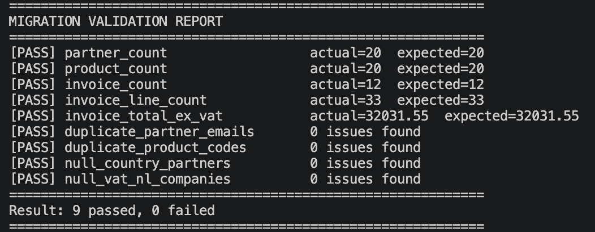
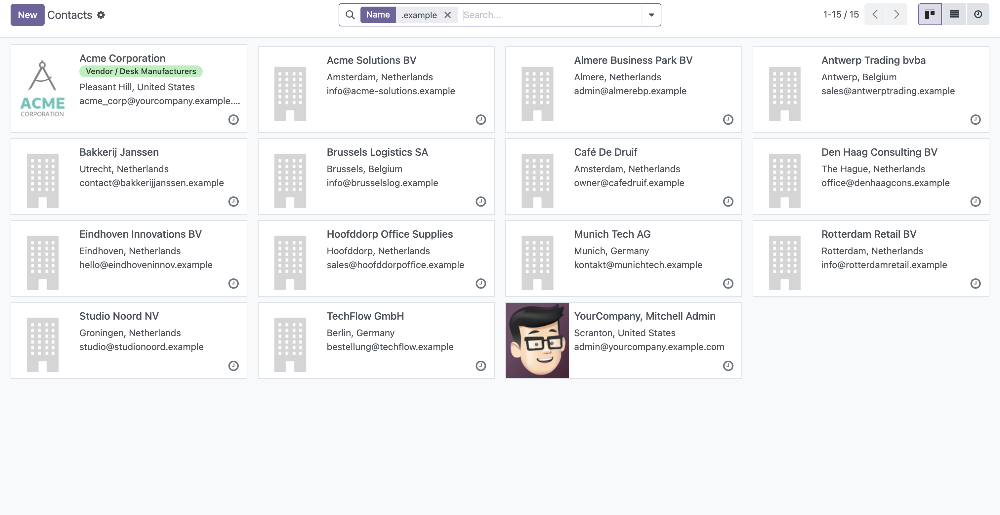
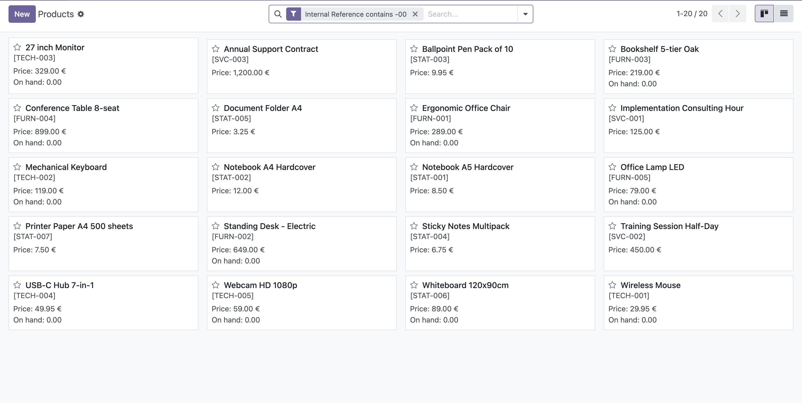
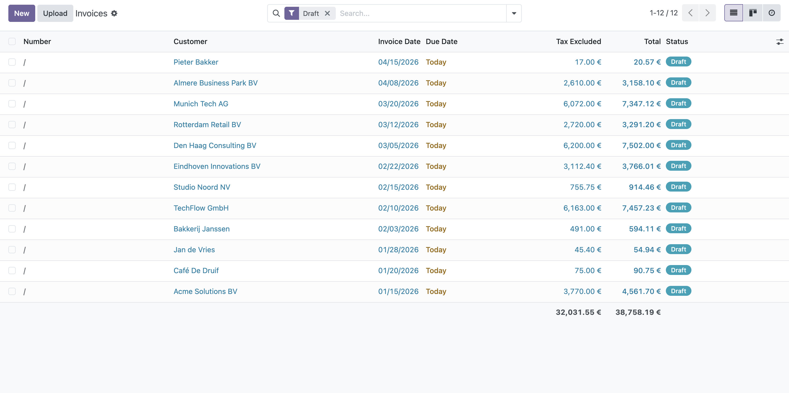

# odoo-csv-migration-toolkit

A Python CLI for CSV-to-Odoo 18 data migration — partners, products, and invoices — over XML-RPC, with SQL-based validation of counts, totals, duplicates, and required-field nulls before go-live sign-off.

Built on Odoo 18 Community. Tested with the OdooMates `om_account_accountant` module for full Accounting features. Works identically on Odoo 18 Enterprise (Invoicing module).

---

## What It Does

### Partner Migration

- Reads a flat CSV of customer/supplier records and creates or updates `res.partner` via XML-RPC
- Resolves country codes (NL, DE, BE, FR) to Odoo country IDs with in-memory caching
- Deduplicates on email — safe to re-run without creating duplicates
- Handles both companies (with VAT) and individuals
- Tags migrated records with `ref = MIGRATION_DEMO` for validation isolation
- Per-row error tolerance — bad rows go to `errors_partners.csv`, batch continues

### Product Migration

- Loads `product.template` records with hierarchical categories (`All / Furniture`)
- Get-or-create pattern for missing category levels
- Looks up sales taxes by exact name (`21% ST` for goods, `21% ST S` for services in the Dutch localization)
- Deduplicates on `default_code` (internal reference)
- Handles Odoo 18's split `type` / `is_storable` fields

### Invoice Migration

- Reads flat CSV of invoice lines and groups by `invoice_number` to build parent + children
- Creates draft `account.move` records via Odoo command tuples `(0, 0, {})`
- Cross-migration foreign keys: partner by email, product by `default_code`
- Draft state only — posting is finance-owned after migration sign-off
- Deduplicates on the source invoice number stored in `ref`

### SQL Validation

- Direct PostgreSQL queries — bypasses the XML-RPC layer that did the loading
- Record counts per model against expected values
- Sum of invoice totals ex-VAT compared to source
- Duplicate detection on natural keys (email, `default_code`)
- Null checks on required fields (country on companies, VAT on NL companies)
- Exit code 0 on all-pass, 1 on any-fail — CI-scriptable

---

## Screenshots

### SQL Validation Report — 9 Checks, All Pass



### Contacts List — Filtered to Migrated Partners



### Products List — Grouped by Category



### Invoices List — Draft State, Filtered by Reference



---

## Architecture

```
sample_data/*.csv   →   src/client.py   →   Odoo 18 (XML-RPC :8069)
                                                   │
                                                   ↓
                                              PostgreSQL
                                                   ↑
                        src/validate.py   ─────────┘
```

Loading goes through Odoo's ORM via XML-RPC, so all validations, computed fields, and defaults fire correctly. Validation queries PostgreSQL directly — bypassing the same layer that did the loading, so a silent XML-RPC bug can't hide itself in a matching-but-wrong result.

---

## Installation

**Prerequisites:** Odoo 18 with the Contacts, Inventory, and Accounting (or Invoicing) modules installed. Netherlands fiscal localization enabled for the tax records the CSVs reference. Python 3.9+ on the client machine.

1. Clone the repo:
```bash
   git clone https://github.com/mayuri2392/odoo-csv-migration-toolkit.git
   cd odoo-csv-migration-toolkit
```
2. Create and activate a Python virtual environment:
```bash
   python3 -m venv venv && source venv/bin/activate
   pip install -r requirements.txt
```
3. Copy the config template and fill in your Odoo details:
```bash
   cp config/odoo.example.ini config/odoo.ini
```
   Edit `config/odoo.ini` with your Odoo URL, database name, admin username, and API key. Set Postgres credentials to match your Docker or local setup.
4. Run the migrations in order (partners → products → invoices):
```bash
   python -m src.migrate_partners --csv sample_data/partners.csv --config config/odoo.ini
   python -m src.migrate_products --csv sample_data/products.csv --config config/odoo.ini
   python -m src.migrate_invoices --csv sample_data/invoices.csv --config config/odoo.ini
```
5. Validate the result:
```bash
   python -m src.validate --config config/odoo.ini
```

> Note: `config/odoo.ini` is gitignored to prevent API keys from leaking. Only `config/odoo.example.ini` (a placeholder template) is committed.

---

## Sample Data

Twenty synthetic Dutch and EU SME partners across NL, DE, BE, and FR — mix of companies (with valid Dutch VAT numbers passing Odoo's mod-11 checksum) and individuals. Twenty products spanning furniture, stationery, electronics, and services categories. Twelve invoices with thirty-three line items totalling €32,031.55 ex-VAT.

All data is synthetic — no real client information.

---

## Technical Notes

- All CSV reads use `dtype=str` to prevent pandas from silently converting phone numbers to integers (a leading `+` is treated as a numeric sign).
- Odoo 18 split the `product.template.type` field. Storable products are `type='consu'` combined with `is_storable=True` — the migration script handles this mapping from the CSV's `type` column.
- Migrated partners are tagged with `ref='MIGRATION_DEMO'` so the validation script can isolate them from Odoo's built-in demo partners without relying on email patterns.
- VAT numbers are validated by Odoo's `base_vat` module at write time. The sample data uses Dutch VAT numbers that pass the mod-11 checksum; DE and BE company VAT fields are left empty rather than faking their country-specific formats.
- Tax lookups are case- and format-sensitive. The sample CSV uses `21% ST` (goods) and `21% ST S` (services) matching the OdooMates NL localization; adjust the `tax_name` column for other Odoo variants.
- Invoices are created in `draft` state only. Posting triggers sequence assignment and general-ledger writes, which are finance-owned actions after migration sign-off.

---

## Author

**Mayuri Patil** Odoo Functional + Technical Consultant [LinkedIn](https://linkedin.com/in/mayuri-patil-2392) · [GitHub](https://github.com/mayuri2392)